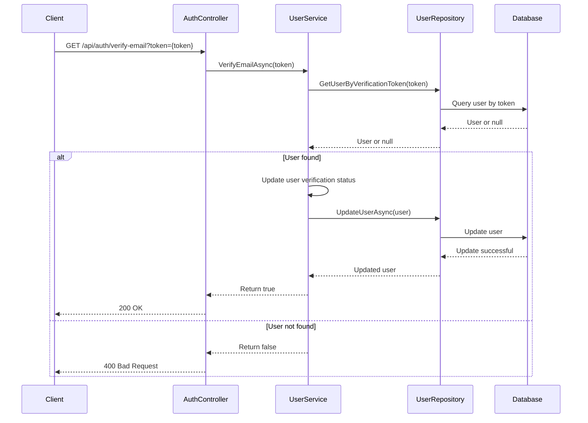

# Verify Email Sequence Diagram

```mermaid
sequenceDiagram
    participant Client
    participant AuthController
    participant UserService
    participant UserRepository
    participant Database

    %% Verify Email Flow
    Client->>AuthController: GET /api/auth/verify-email?token={token}
    AuthController->>UserService: VerifyEmailAsync(token)
    
    UserService->>UserRepository: GetUserByVerificationToken(token)
    UserRepository->>Database: Query user by token
    Database-->>UserRepository: User or null
    UserRepository-->>UserService: User or null
    
    alt User found
        UserService->>UserService: Update user verification status
        UserService->>UserRepository: UpdateUserAsync(user)
        UserRepository->>Database: Update user
        Database-->>UserRepository: Update successful
        UserRepository-->>UserService: Updated user
        
        UserService-->>AuthController: Return true
        AuthController-->>Client: 200 OK
    else User not found
        UserService-->>AuthController: Return false
        AuthController-->>Client: 400 Bad Request
    end
``` 