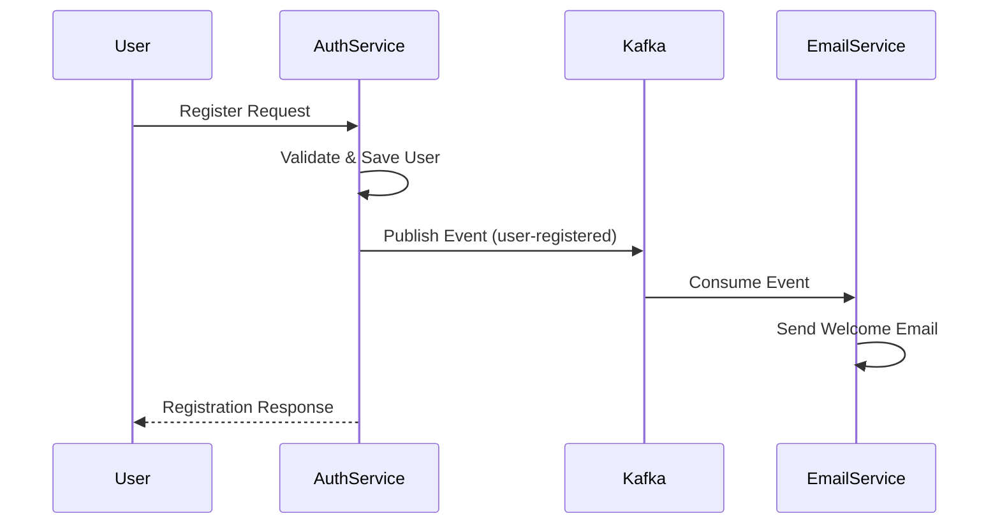
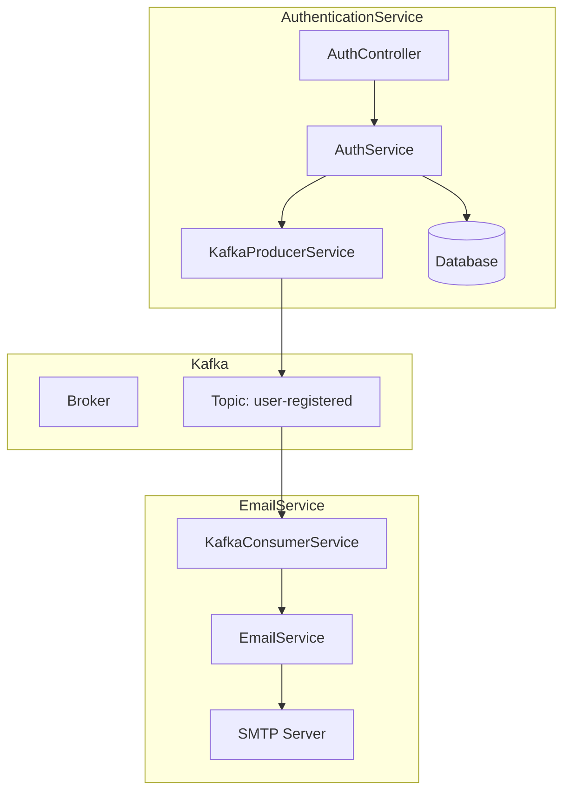
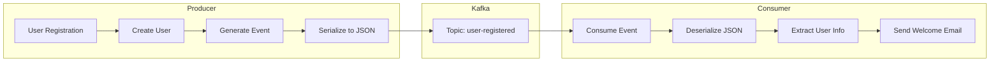

# Kafka Integration Guide - AuthenticationService và EmailService

## 1. AuthenticationService (Producer)

### 1.1. KafkaProducerService.cs
```csharp
public class KafkaProducerService
{
    // Producer instance để gửi message đến Kafka
    private readonly IProducer<string, string> _producer;
    // Tên topic sẽ gửi message đến
    private const string Topic = "user-registered";

    public KafkaProducerService()
    {
        // Cấu hình producer
        var config = new ProducerConfig
        {
            // Địa chỉ Kafka broker
            BootstrapServers = "localhost:9092"
        };

        // Khởi tạo producer với config đã cấu hình
        _producer = new ProducerBuilder<string, string>(config).Build();
    }

    public async Task PublishUserRegisteredEvent(string email, string username)
    {
        // Tạo message object
        var message = new
        {
            Email = email,
            Username = username,
            Timestamp = DateTime.UtcNow
        };

        // Chuyển đổi message thành JSON string
        var jsonMessage = JsonSerializer.Serialize(message);

        // Gửi message đến Kafka
        await _producer.ProduceAsync(Topic, new Message<string, string>
        {
            // Key là email của user
            Key = email,
            // Value là JSON message
            Value = jsonMessage
        });
    }

    public void Dispose()
    {
        // Giải phóng tài nguyên khi service bị dispose
        _producer?.Dispose();
    }
}
```

### 1.2. AuthService.cs
```csharp
public class AuthService
{
    private readonly AuthDbContext _context;
    private readonly IConfiguration _configuration;
    // Inject KafkaProducerService
    private readonly KafkaProducerService _kafkaProducer;

    public AuthService(AuthDbContext context, IConfiguration configuration, KafkaProducerService kafkaProducer)
    {
        _context = context;
        _configuration = configuration;
        _kafkaProducer = kafkaProducer;
    }

    public async Task<AuthResponse> Register(RegisterDTO registerDTO)
    {
        // Kiểm tra email đã tồn tại chưa
        if(await _context.Users.AnyAsync(u => u.Email == registerDTO.Email))
        {
            throw new Exception("Email already exists");
        }

        // Tạo user mới
        var user = new User
        {
            Username = registerDTO.Username,
            Email = registerDTO.Email,
            PasswordHash = registerDTO.Password
        };

        // Lưu user vào database
        _context.Users.Add(user);
        await _context.SaveChangesAsync();

        // Gửi event đến Kafka
        await _kafkaProducer.PublishUserRegisteredEvent(user.Email, user.Username);

        return new AuthResponse
        {
            Token = "test",
            Username = user.Username,
            Email = user.Email
        };
    }
}
```

### 1.3. Program.cs (AuthenticationService)
```csharp
// Đăng ký KafkaProducerService là singleton
builder.Services.AddSingleton<KafkaProducerService>();
```

## 2. EmailService (Consumer)

### 2.1. KafkaConsumerService.cs
```csharp
public class KafkaConsumerService : BackgroundService
{
    // Consumer instance để nhận message từ Kafka
    private readonly IConsumer<string, string> _consumer;
    // Service để gửi email
    private readonly IEmailService _emailService;
    // Tên topic sẽ lắng nghe
    private const string Topic = "user-registered";

    public KafkaConsumerService(IEmailService emailService)
    {
        // Cấu hình consumer
        var config = new ConsumerConfig
        {
            // Địa chỉ Kafka broker
            BootstrapServers = "localhost:9092",
            // ID của consumer group
            GroupId = "email-service-group",
            // Đọc message từ đầu nếu không có offset
            AutoOffsetReset = AutoOffsetReset.Earliest
        };

        // Khởi tạo consumer với config đã cấu hình
        _consumer = new ConsumerBuilder<string, string>(config).Build();
        _emailService = emailService;
    }

    protected override async Task ExecuteAsync(CancellationToken stoppingToken)
    {
        // Đăng ký lắng nghe topic
        _consumer.Subscribe(Topic);

        // Vòng lặp vô hạn để chờ message
        while (!stoppingToken.IsCancellationRequested)
        {
            try
            {
                // Đợi và nhận message từ Kafka (blocking call)
                var consumeResult = _consumer.Consume(stoppingToken);
                
                // Chuyển đổi JSON message thành object
                var message = JsonSerializer.Deserialize<UserRegisteredEvent>(consumeResult.Message.Value);

                if (message != null)
                {
                    // Gửi email chào mừng
                    await _emailService.SendWelcomeEmail(message.Email, message.Username);
                }
            }
            catch (Exception ex)
            {
                // Log lỗi nếu có
                Console.WriteLine($"Error processing message: {ex.Message}");
            }
        }
    }

    public override void Dispose()
    {
        // Giải phóng tài nguyên khi service bị dispose
        _consumer?.Dispose();
        base.Dispose();
    }
}

// Model cho message từ Kafka
public class UserRegisteredEvent
{
    public required string Email { get; set; }
    public required string Username { get; set; }
    public DateTime Timestamp { get; set; }
}
```

### 2.2. Program.cs (EmailService)
```csharp
// Đăng ký IEmailService là singleton
builder.Services.AddSingleton<IEmailService, EmailService.Services.EmailService>();
// Đăng ký KafkaConsumerService là hosted service
builder.Services.AddHostedService<KafkaConsumerService>();
```

## 3. Luồng hoạt động

1. User đăng ký thông qua AuthenticationService
2. AuthService lưu user vào database
3. AuthService gửi event đến Kafka topic "user-registered"
4. KafkaConsumerService trong EmailService nhận được event
5. EmailService gửi email chào mừng cho user mới

## 4. Lưu ý quan trọng

1. Cả hai service đều cần package Confluent.Kafka
2. KafkaProducerService và IEmailService được đăng ký là singleton
3. KafkaConsumerService là một BackgroundService, chạy liên tục để lắng nghe message
4. Cần đảm bảo Kafka broker đang chạy và topic "user-registered" đã được tạo
5. Cấu hình SMTP trong EmailService cần được thiết lập đúng để gửi email 

## 5. Architecture Diagram

### 5.1. Sequence Diagram


### 5.2. Component Diagram


### 5.3. Data Flow Diagram


## 6. Message Format

### 6.1. Event Structure
```json
{
    "Email": "user@example.com",
    "Username": "username",
    "Timestamp": "2024-03-21T10:00:00Z"
}
```

### 6.2. Kafka Message Format
- **Topic**: user-registered
- **Key**: User's email address
- **Value**: JSON string containing user registration event
- **Partition**: 1 (default)
- **Replication Factor**: 1 (development)

## 7. Error Handling

### 7.1. Producer Side
- Retry logic for failed message publishing
- Logging of failed attempts
- Transaction rollback if both DB save and Kafka publish fail

### 7.2. Consumer Side
- Automatic retry for failed message processing
- Dead letter queue for unprocessable messages
- Error logging and monitoring
- Graceful shutdown handling 