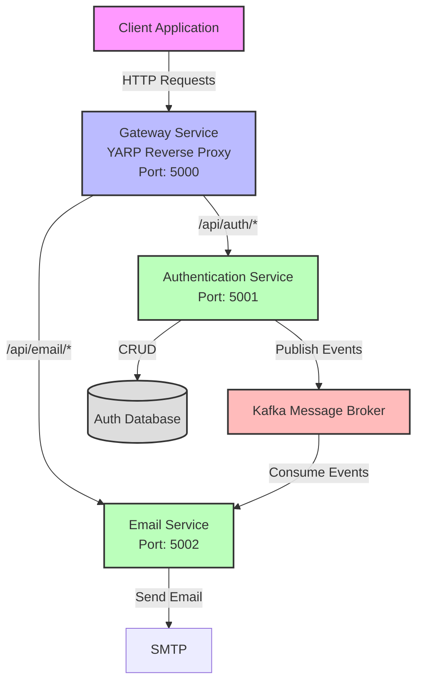
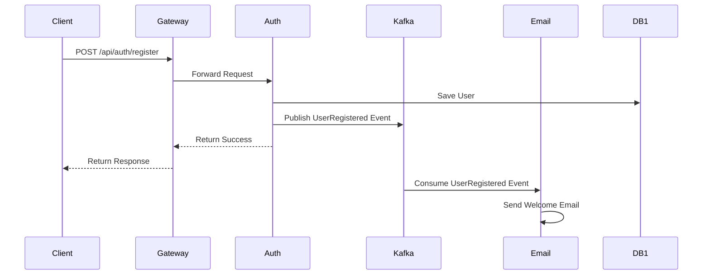
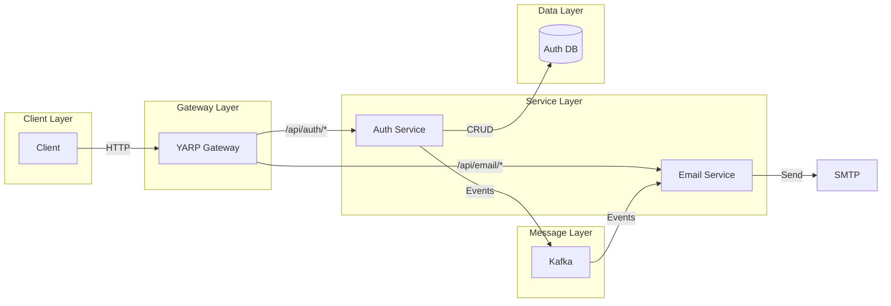
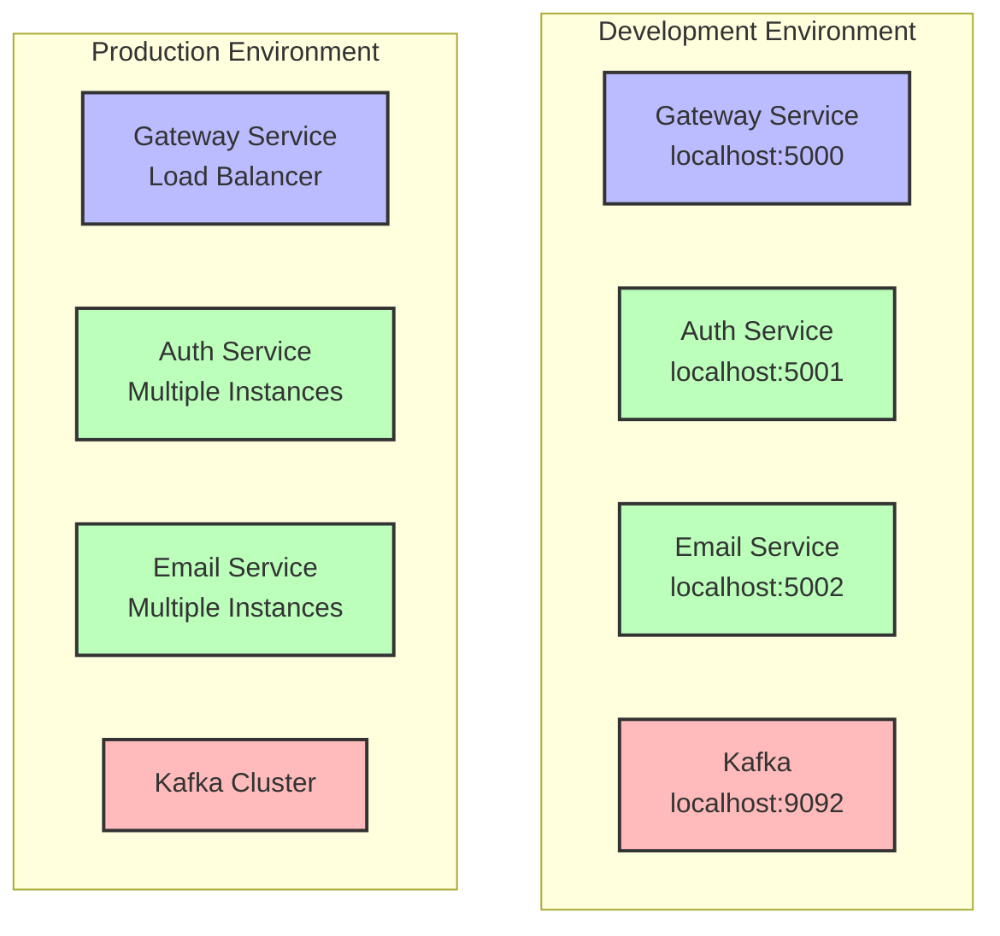
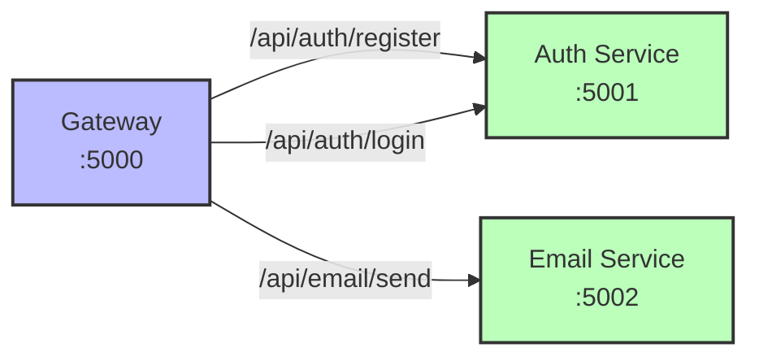
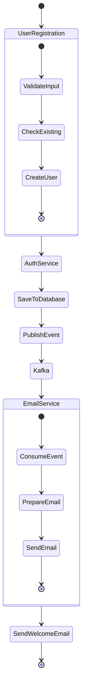
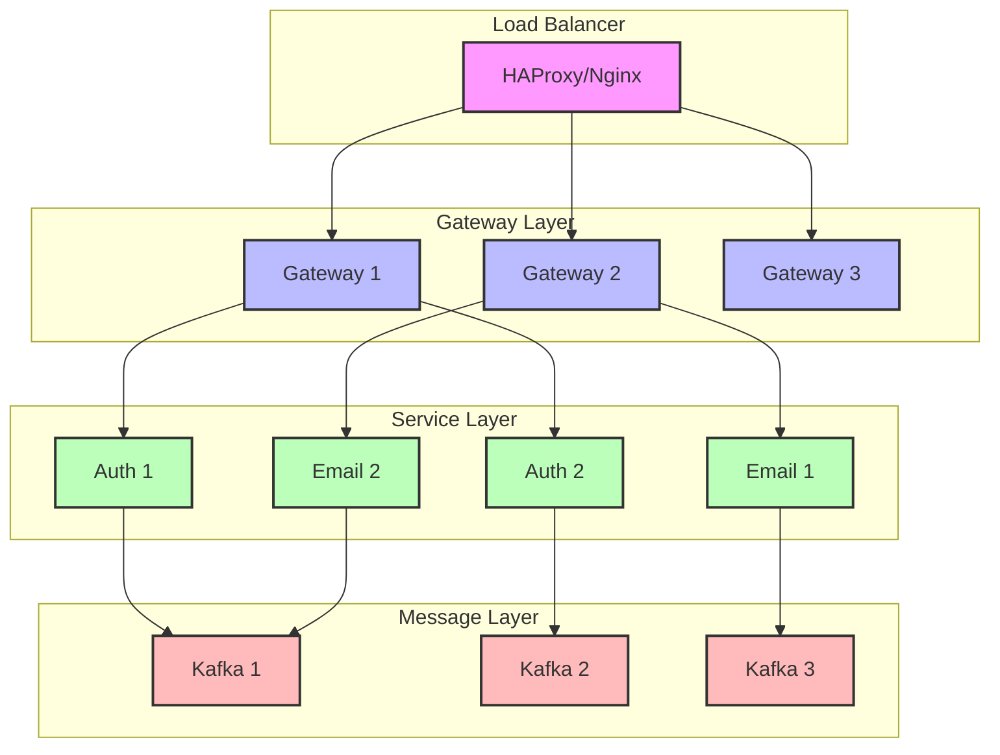

# Kiến Trúc Microservice với Gateway, Authentication và Email Service

## 1. Component Diagram

## 2. Sequence Diagram - User Registration Flow

## 3. Data Flow Diagram

## 4. Deployment Diagram

## 5. API Gateway Routes

## 6. Event Flow Diagram

## 7. Scaling Strategy

